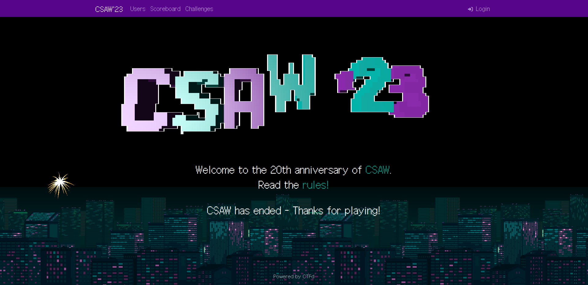

# CSAW Quals CTF 2k23 Write-Ups

Welcome to CSAW Quals CTF 2k23 Challenges' Write-Ups Repository, you can find all detailed solutions of each ctf's challenge.

## Introduction 

CSAW CTF is one of the oldest and biggest CTFs with 884 teams with 1+ points in 2022. Designed as an entry-level, jeopardy-style CTF, this competition is for students who are trying to break into the field of security, as well as for advanced students and industry professionals who want to practice their skills.

Our competition occurs over two rounds: a Qualifying Round in September and a Final Round in November.

## Content

- [Web Exploitation](./web/)
- [Cryptography](./crypto/)
- [Miscellaneous](./misc/)
- [Forensics](./forensics/)
