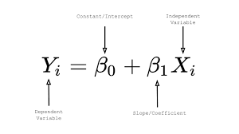

# LINEAR AGGRESSOR

## Description

> Wall Street Traders dropped a new model! I hope no one can steal it.
>
> Connect with: nc misc.csaw.io 3000

## Write-Up

From the title description of the challenge, we can deduce that we are dealing with a **Linear Regression Model** that takes inputs, and give us an output.

While search on **Adversarial Attacks on linear regression model**, and more precisely taking our case in consideration, we find the following method:

> **Model Extraction:** Model stealing or model extraction involves an attacker probing a black box machine learning system in order to either reconstruct the model or extract the data it was trained on. This is especially significant when either the training data or the model itself is sensitive and confidential. Model extraction attacks can be used, for instance, to steal a stock market prediction model, which the adversary could use for their own financial benefit.

Which fits exatcly our case scenario. 

**Solution:** Furthermore, as we know the equation of linear regression models :



From there, and as we have `30` inputs, we deduce that we have `30` feature `a0...a29` to extract plus the `b` (biais). From there, we can for `30` tries when each time we leave only one feature on and shutfown all others feature. at the end, we shutdown all feature to get the `b` value and substract it from the extracted features. We suspect the flag to be asciis of the features.

Here is the code:

```py
#! /usr/bin/python3


from pwn import *

HOST = 'misc.csaw.io'
PORT = 3000

lst = []

# Extract from a0 to a29
for i in range(26, 30):
    p = remote(HOST, PORT)

    for j in range(30):
        if j == i:
            p.sendlineafter(b'Enter your input: \r\n', b'1')
        else:
            p.sendlineafter(b'Enter your input: \r\n', b'0')
    print(f"Sent {i}!")

    p.recvline()
    lst.append(p.recvline())
    print(lst)
    p.close()


# Extract b
p = remote(HOST, PORT)

for j in range(30):
    p.sendlineafter(b'Enter your input: \r\n', b'0')
print(f"Sent 30!")

p.recvline()
lst.append(p.recvline())
print(lst)
p.close()

# Construct Flag
# lst = [b'224\r\n', b'240\r\n', b'222\r\n', b'244\r\n', b'224\r\n', b'241\r\n', b'227\r\n', b'248\r\n', b'234\r\n', b'173\r\n', b'225\r\n', b'176\r\n', b'174\r\n', b'220\r\n', b'178\r\n', b'241\r\n', b'176\r\n', b'177\r\n', b'174\r\n', b'230\r\n', b'235\r\n', b'228\r\n', b'220\r\n', b'230\r\n', b'178\r\n', b'220\r\n', b'223\r\n', b'177\r\n', b'225\r\n', b'250\r\n', b'125\r\n']

newlst = [int(l.strip()) for l in lst]
flag_chars = [chr(c - newlst[-1]) for c in newlst]

flag = ''.join(flag_chars)

print(flag)
```

## Flag

csawctf{m0d31_5t341ing_i5_b4d}

## More Information

- https://www.toptal.com/machine-learning/adversarial-machine-learning-tutorial
- https://viso.ai/deep-learning/adversarial-machine-learning/
- http://www.cleverhans.io/2020/04/06/stealing-bert.html
